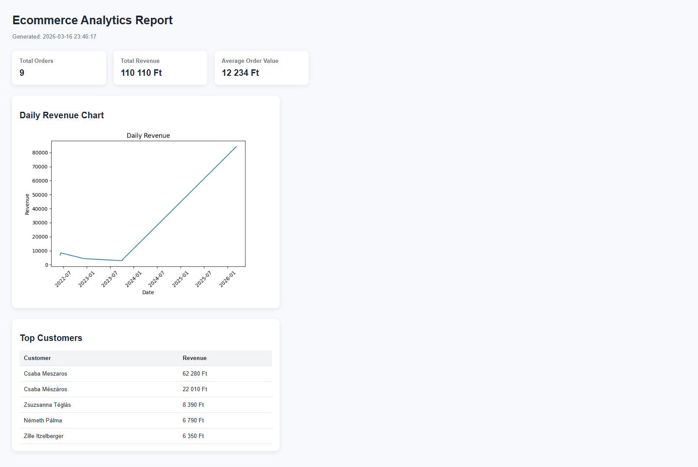
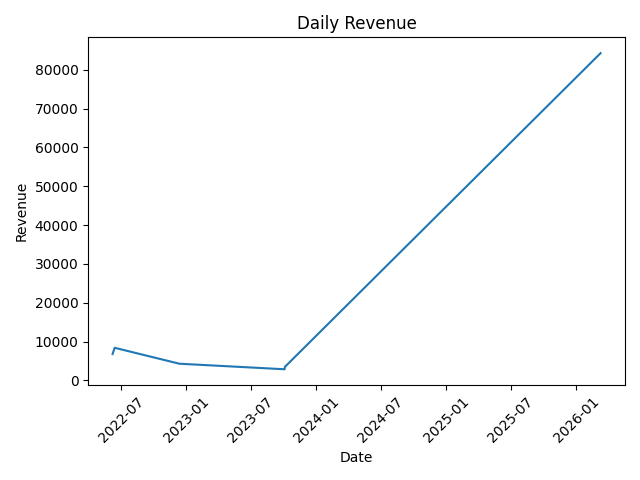

# Ecommerce Analytics Pipeline

A Python-based data pipeline that collects WooCommerce order data via REST API, stores it in an SQL database, analyzes the data using pandas, and generates reports and visualizations.

This project demonstrates a realistic **data engineering / analytics workflow** including API integration, SQL processing, data analysis, and automated reporting.

---

# Features

- WooCommerce REST API integration
- SQLite database storage
- SQL-based KPI calculations
- Pandas data analysis
- Revenue visualization with Matplotlib
- TXT report generation
- HTML report generation
- CLI interface
- Logging system
- Modular Python project structure

---

# Tech Stack

- Python
- SQLite
- Pandas
- Matplotlib
- Requests
- argparse
- logging

---

# Project Structure

```text
ecommerce-analytics-pipeline
│
├── src
│ ├── api
│ │ └── client.py
│ │
│ ├── database
│ │ ├── db.py
│ │ └── schema.py
│ │
│ ├── pipeline
│ │ ├── save_orders.py
│ │ ├── sql_metrics.py
│ │ ├── analysis.py
│ │ ├── visualization.py
│ │ ├── report_txt.py
│ │ └── report_html.py
│ │
│ ├── cli
│ │ └── cli.py
│ │
│ └── utils
│ └── logger.py
│
├── data
│ └── ecommerce.db
│
├── output
│ ├── charts
│ │ └── daily_revenue.png
│ │
│ ├── reports
│ │ ├── report.txt
│ │ └── report.html
│ │
│ └── logs
│ └── pipeline.log
│
├── main.py
├── requirements.txt
└── README.md
```


---

# Installation

### Clone the repository:

```bash
git clone https://github.com/csabametzg/ecommerce-analytics-pipeline.git
cd ecommerce-analytics-pipeline
```

###  Create virtual environment:

```bash
python -m venv venv
```

### Activate environment:

Windows

```bash
venv\Scripts\activate
```

Mac / Linux
```bash
source venv/bin/activate
```

Install dependencies:
```bash
pip install -r requirements.txt
```

# Environment Variables
Create a .env (example) file in the project root:
```text
WC_BASE_URL=https://your-store-url.com
WC_CONSUMER_KEY=your_consumer_key
WC_CONSUMER_SECRET=your_consumer_secret
```

Example file provided:
```text
.env.example
```
The .env file is ignored by Git for security reasons.

# Usage
```bash
python main.py
```

Limit number of orders fetched from API:

```bash
python main.py --skip-charts
```

# Example Output

The pipeline generates several outputs:

### Database
```text
data/ecommerce.db
```

### Revenue Chart
```text
output/charts/daily_revenue.png
```

### TXT Report
```text
output/reports/report.txt
```

### Example content:

```text
Ecommerce Analytics Report
===========================

Total Orders: 9
Total Revenue: 1324.50
Average Order Value: 147.17

Top Customers
-------------
John Doe - 430
Jane Smith - 320
```

### HTML Report
```text
output/reports/report.html
```
This provides a simple visual dashboard.

### Logs
```text
output/logs/pipeline.log
```
### Example:
```text
INFO | Pipeline started
INFO | Database initialized
INFO | Fetching orders from API
INFO | Orders saved to database
INFO | Daily revenue chart generated
```

# Example Metrics
Example analytics calculated from the database:
```text
Total Orders: 9
Total Revenue: 1324.50
Average Order Value: 147.17
```

Top customers by revenue:
```text
John Doe: 430
Jane Smith: 320
Michael Brown: 210
```

# CLI Options
Available command line parameters:

| Parameter       | Description                        |
| --------------- | ---------------------------------- |
| `--limit`       | Limit number of API orders fetched |
| `--skip-charts` | Skip visualization generation      |


### Examples:

```bash
python main.py --limit 10
```
```bash
python main.py --skip-charts
```

# Logging

All pipeline operations are logged.

Log file:
```text
output/logs/pipeline.log
```

# Future Improvements

- Configuration file support 
- Unit tests 
- Docker container 
- Scheduled pipeline execution 
- Dashboard UI

# Author

Csaba Mészáros

GitHub:
https://github.com/csabametzg


# License
MIT License


## Dashboard Example



---

## Revenue Chart

